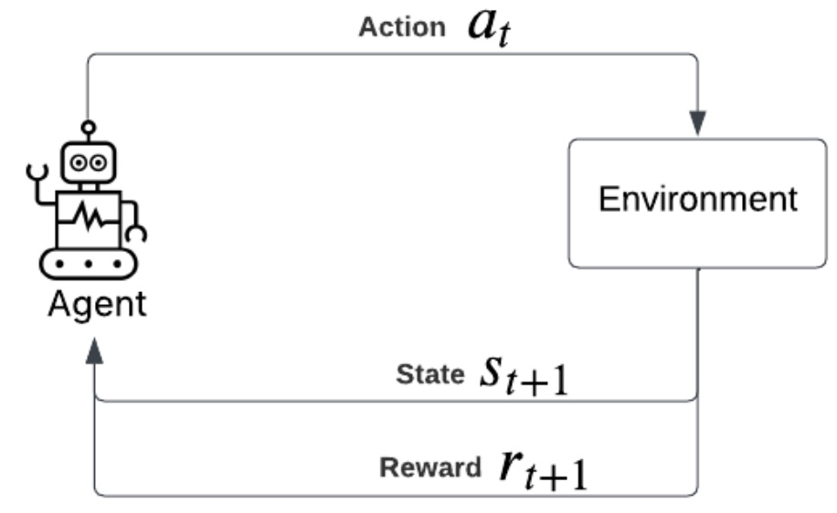
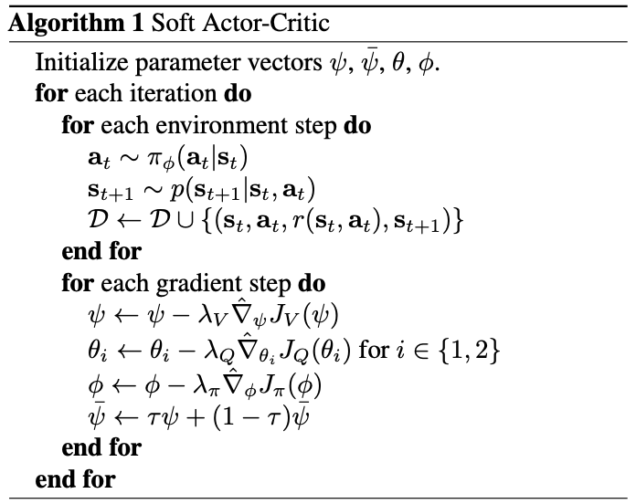
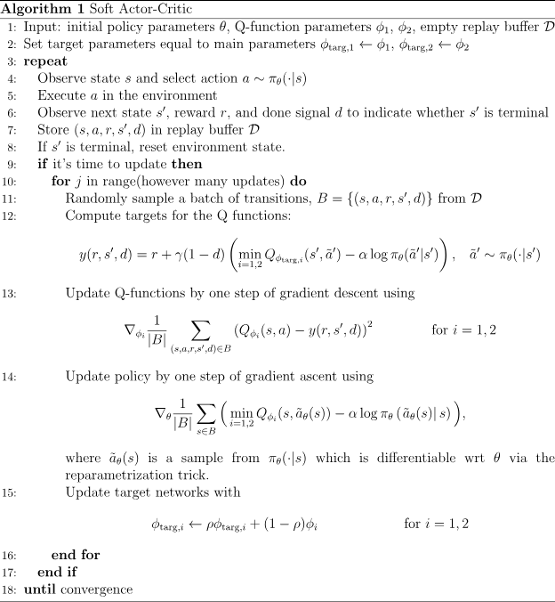

# Soft Actor Critic Tutorial

**Author:** Yeshwant Dattatreya

## Introduction
Soft Actor-Critic (SAC) was published in 2018, and it quickly became a go-to baseline for continuous-control reinforcement learning. Its main contribution is a clean, practical way to do off-policy (learn from data generated by a different policy than the current policy) actor-critic (learn both: how good an action is, and a policy that picks good actions) reinforcement learning (RL) while also optimizing a maximum-entropy objective - meaning the agent is rewarded not just for high return, but also for keeping its policy stochastic enough to explore. In this tutorial, we’ll do a detailed walkthrough of the algorithm with an emphasis on intuitive explanations, and we’ll connect each idea directly to what we implement in code. We’ll start with LunarLander from Gym as a friendly environment to get everything working end-to-end, and once the core pieces make sense, we’ll reuse the same SAC setup and adapt it to a harder MuJoCo Humanoid environment.

## RL in a Nutshell
RL is a setup where an agent learns by interacting with an environment. At each step, the agent chooses an action using a policy (often a neural network, that maps what an agent observes to what it does). The environment transitions to a new state and gives a reward. The goal is to learn a policy that maximizes total reward over time.

- The agent observes a state $s_t$
- It chooses an action $a_t \sim \pi(\cdot \mid s_t)$
- The environment returns a reward $r_t$ and a next state $s_{t+1}$



## Policies, Rewards, and the RL Objective
A policy $\pi$ is a mapping from states to actions. In continuous control, we usually use a stochastic policy $\pi(a \mid s)$ that outputs a distribution over actions.

The goal is to maximize expected discounted return:

$$
J(\pi) = \mathbb{E}\left[\sum_{t=0}^{\infty} \gamma^t r(s_t, a_t)\right]
$$

where $\gamma \in (0,1)$ is the discount factor.

## Value Functions
To reason about how good actions and states are, we define value functions.

- State-value function:

$$
V^\pi(s) = \mathbb{E}\left[\sum_{t=0}^{\infty} \gamma^t r(s_t, a_t) \mid s_0 = s\right]
$$

- Action-value function (Q-function):

$$
Q^\pi(s,a) = \mathbb{E}\left[\sum_{t=0}^{\infty} \gamma^t r(s_t, a_t) \mid s_0 = s, a_0=a\right]
$$

They are related by:

$$
V^\pi(s) = \mathbb{E}_{a \sim \pi(\cdot \mid s)}[Q^\pi(s,a)]
$$

## The Actor-Critic Loop
Actor-critic methods learn:

- **Actor:** the policy $\pi_\theta(a \mid s)$
- **Critic:** the value function (often $Q_\phi(s,a)$)

The critic learns to estimate how good actions are, and the actor uses that to improve the policy.

In SAC, we do this off-policy using a replay buffer.

## Entropy Regularization: Key Idea Behind SAC
SAC optimizes a *maximum-entropy* objective. This means we want to maximize reward while also keeping the policy stochastic.

Entropy of a policy is:

$$
H(\pi(\cdot \mid s)) = - \mathbb{E}_{a \sim \pi(\cdot \mid s)}[\log \pi(a \mid s)]
$$

SAC augments the RL objective:

$$
J(\pi) = \mathbb{E}\left[\sum_{t=0}^{\infty} \gamma^t \left(r(s_t,a_t) + \alpha H(\pi(\cdot \mid s_t))\right)\right]
$$

where $\alpha$ controls the reward/entropy tradeoff.

## SAC Algorithm Overview
SAC uses:

- Two Q networks $Q_{\phi_1}$ and $Q_{\phi_2}$ (clipped double Q)
- A policy network $\pi_\theta$
- Target Q networks for stability

The critic target is:

$$
y = r + \gamma(1-d)\left(\min(Q_{\text{targ},1}, Q_{\text{targ},2}) - \alpha \log \pi(a' \mid s')\right)
$$





## Coding SAC

### Lunar Lander Environment
We'll use gym's LunarLanderContinuous environment, where the agent controls a small lander using continuous thrusters.

- Observation dimension: 8
- Action dimension: 2
- Action range: $[-1,1]$

### Policy: Gaussian + Tanh Squash
We model the policy as a Gaussian and apply $\tanh$ to squash actions into the correct range.

Key detail: when using $\tanh$, you must correct the log-prob with the Jacobian term.

```python
u = normal.rsample()
a = torch.tanh(u)

logp = normal.log_prob(u)
logp -= torch.log(1 - a.pow(2) + 1e-6)   # tanh correction
logp = logp.sum(dim=1, keepdim=True)
